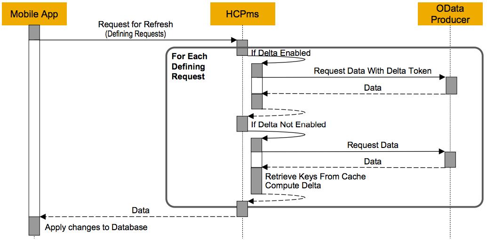
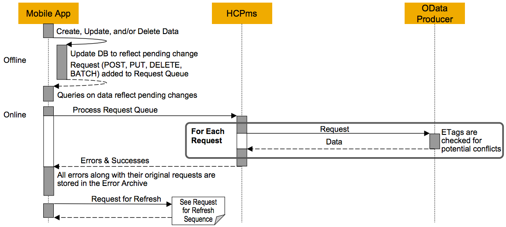

## Prerequisites  

- **Development environment:** Apple iMac, MacBook or MacBook Pro running Xcode 11 or higher
- **SAP BTP SDK for iOS:** Version 4.0.10
- **Tutorials:** [Manage usage statistics on SAP Mobile Services for development and operations](fiori-ios-hcpms-reporting)

## Details

### You will learn  

How the SAP BTP SDK for iOS creates an offline store on the mobile device, how it keeps data in sync, and how data entered locally is flushed back to the originating OData service

---

You may have noticed that if you launch modern apps such as Facebook, LinkedIn and your E-mail application, they will also work when you are offline. Instead of an empty screen, they show you cached data of the last time they were connected. Needless to say, making an app work in even offline scenario's increases overall user-experience and may have business benefits.

Not having any data connection in even the wealthiest and most developed cities of the world could lead to the conclusion that the mobile connectivity/bandwidth issue isn't just going to solve itself on a global level anywhere in the near future. Capacity problems at crowded areas or events, varying coverage and zones with zero reception, unreliable connections (both WiFi and telco) and problems incurred through traveling will likely persist.

This is the reason why many apps are sensitive to the device's connection state and have offline fallback mechanisms built-in. When in offline mode, some aspects of an app will necessarily stop working, but many others don't.

> Why offline: Business doesn't always happen where networks exist.

[ACCORDION-BEGIN [Step 1: ](SAP BTP SDK for iOS - Offline OData service)]

The Offline OData feature of the SAP BTP SDK for iOS allows you to develop Always-available application that can respond quickly to changes in the connection state. Instead of calling OData services directly, the OData service call will be redirected to the Offline OData feature, which will mimic a response using the latest synchronized data.

Features:

- Synchronize OData services and run them locally on a device
- UltraLite as client database, which is optionally encrypted
- Optimized for OData services supporting delta queries to synchronize only new and changed items
- Middle-tier delta enablement on SAP BTP for services that don't support delta queries
- Middle-tier caching of generic OData collections that are not user dependent, so that e.g. not every user needs to read the same master data from the source OData service
- Offline OData services work in both read and write mode, allowing users to enter data on their device. OData updates are played back to the originating OData service when the user comes back online.
- Data synchronization between the app and the SAP BTP will leverage the MobiLink protocol which is designed for synchronizing remote databases.

Please find a schematic representation of the synchronization flow below:


Test image description


[DONE]
[ACCORDION-END]

[ACCORDION-BEGIN [Step 2: ](Creation of a database)]

The Offline OData database is dependent on so-called defining queries. You could see a defining query as a definition for a database table in the Offline Store. A set of defining requests specify the data that will populate the offline store.

A defining query could look like this:

```swift
let teacherDQ = OfflineODataDefiningQuery( name: "Teacher", query: "Teachers", automaticallyRetrievesStreams: false )
let studentDQ = OfflineODataDefiningQuery( name: "Student", query: "Students", automaticallyRetrievesStreams: false )
```

The code above defined a defining query resulting in a table called `Teacher`, which will be populated by retrieving the entity `Teachers` from the OData service. To determine which attributes the table should have, the OData metadata is retrieved and the table will be built-up in accordance with OData Entity definition from the metadata.

Please find a schematic representation of the creation and population of the database below:


When a database is being opened for the first time, the app sends the defining queries over to the SAP Mobile Services for development and operations. At the SAP Mobile Services for development and operations back-end is determined whether a client store already exists for the device being used. If it doesn't. SAP Mobile Services for development and operations will pull the metadata from the originating OData service and will create a table for each of the defined queries. Once the tables have been created, the tables are synchronized by retrieving the data from the originating OData service. Once the table is fully synchronized on the SAP Mobile Services for development and operations back-end, the table is synchronized to the Offline UltraLite store on the client using the MobiLink protocol.

[DONE]
[ACCORDION-END]

[ACCORDION-BEGIN [Step 3: ](Refreshing the database)]

After a user has been offline for a while and data on the device needs to be updated, the Request for Refresh sequences is started. This sequence starts with sending the defined requests to the back-end again. However, these defined requests are not used to build up the database, as the database already exists.

Please find a schematic representation of the request for refresh sequence below:



When the database is being refreshed the the app sends the defining queries over to the SAP Mobile Services for development and operations. If the originating OData service supports delta-token, the client store on the SAP Mobile Services for development and operations is refreshed using delta-tokens, otherwise a full refresh of the client store is performed. Once the client store is in sync all changes are sent to the client using the MobiLink protocol.

[DONE]
[ACCORDION-END]

[ACCORDION-BEGIN [Step 4: ](Data Flush sequence)]

After a user has entered data, and when the user is back online again, the entered data needs to be uploaded to the originating OData service. This is achieved by collecting all requests that need to be executed in the Offline store on the device, synchronizing them to the SAP Mobile Services for development and operations back-end, and from there they will be played back on the originating OData service in the same order as in which they were received.

Please find a schematic representation of the data flush sequence below:



In the diagram, you can see that the requests are being sent to the offline store on the device, in which the changes are captured. Once the user goes online and flushes his data, the request queue is being synchronized to the SAP Mobile Services for development and operations back-end. From there, SAP Mobile Services for development and operations will playback each request to the originating OData service. All errors along with their original requests are stored in the Error Archive, which manifest itself as an OData entity set named `ErrorArchive`.

[DONE]
[ACCORDION-END]

[ACCORDION-BEGIN [Step 5: ](Error and events)]

Unlike in the online scenario where most errors are displayed immediately, errors happening in the offline scenario errors are not discovered until the upload operation is performed.

When a request fails against the backend OData Service during an upload operation, the request and any relevant details are stored in the `ErrorArchive` entity in the Offline Store. App developers must determine what to do for these errors and whether they want to fix, merge or revert entries that have an error state.

Events that happened during synchronization can be retrieved in a similar fashion as the errors. Events are stored in the `EventLog` entity set.

[DONE]
[ACCORDION-END]

[ACCORDION-BEGIN [Step 6: ](Configuration of the SAP BTP)]

To leverage the offline store features it is not necessary to add any specific configuration to your application. In that case, SAP Mobile Services for development and operations will apply defaults that will make a good amount of applications run smoothly.

However, it is possible to tune the configuration of offline applications to optimize offline performance by defining e.g.:

- Column indexes for the client database
- Common user data to cache on the server to reduce the amount of data that needs to be synchronized with the back end.

[DONE]
[ACCORDION-END]
